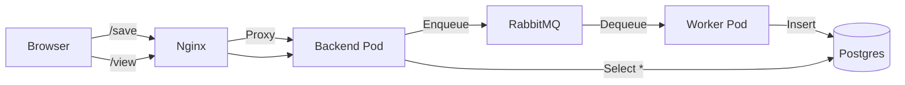

# Kubernetes Microservices Demo

This project demonstrates a complete **Event-Driven Microservices Architecture** running locally on Kubernetes (using `kind`). It simulates a real-world production environment with frontend proxies, backend APIs, message queues, background workers, and persistent databases.

## 🏗️ System Architecture

The application handles user requests to save data, queues them for processing, and stores them in a database, surviving pod restarts.



### 🧱 Core Components & Concepts

We implemented several advanced Kubernetes concepts to make this work:

#### 1. Ingress & Routing (`Nginx`)
*   **Concept**: **Reverse Proxy**.
*   **Role**: Serves as the single entry point (Gateway) for the user. It receives requests on port 80 and routes them to the internal backend service.
*   **Why**: Decouples the frontend access from the backend implementation.

#### 2. The Backend API (`Deployment`)
*   **Concept**: **Stateless Microservice**.
*   **Role**: A Python script (`app.py`) that accepts HTTP requests.
*   **Key Feature**: **Readiness Probes**. We added a TCP Readiness Probe to ensure traffic is only sent to the pod *after* `pip install` completes and the port is open. This fixed the "502 Bad Gateway" errors.
*   **Logic**: Instead of writing to a file, it **publishes** a message to RabbitMQ. This makes the API extremely fast as it doesn't wait for disk I/O.

#### 3. Message Broker (`RabbitMQ`)
*   **Concept**: **Decoupling**.
*   **Role**: Holds messages in a queue (`task_queue`) until a worker can process them.
*   **Why**: If the database is slow or down, the API can still accept user requests. The messages just pile up in the queue safely.

#### 4. Background Worker
*   **Concept**: **Consumer**.
*   **Role**: A dedicated Python script (`worker.py`) that constantly listens to RabbitMQ.
*   **Logic**: It takes a message, connects to the Database, and inserts the data.
*   **Scalability**: We can scale this `Deployment` independently. If the queue gets full, we just add more workers!

#### 5. Database (`StatefulSet` + `PVC`)
*   **Concept**: **Stateful Application**.
*   **Role**: PostgreSQL database running in a pod.
*   **Why StatefulSet?**: Unlike Deployments (which are ephemeral), a StatefulSet guarantees stable network IDs.
*   **Persistence**: We used a **PersistentVolumeClaim (PVC)**. The data is stored on the "physical" node (your laptop's Docker partition). Even if we delete the Postgres pod, the data remains safe on the volume.

#### 6. Configuration Management
*   **ConfigMaps**: Stores all our application code (`app.py`, `worker.py`, endpoints) and HTML (`index.html`). This allows us to update code without building new Docker images.
*   **Secrets**: Stores sensitive data like `POSTGRES_PASSWORD` and `OWNER_NAME`. These are injected as Environment Variables.

---

## 🛠️ How to Manage the Cluster

We created several automation scripts to make life easy:

### 1. Start / Reset (`start-cluster.sh`)
Builds the entire infrastructure from scratch.
```bash
./start-cluster.sh
```
*   Creates Kind cluster.
*   Applies all ConfigMaps, Secrets, Services, Deployments, and StatefulSets.

### 2. Update Code (`update-code.sh`)
Deploys code changes instantly without rebuilding the cluster.
```bash
./update-code.sh
```
*   Regenerates the ConfigMap from your local `code/` folder.
*   Restarts Backend and Worker pods to pick up the new code.

### 3. Destruction (`delete-cluster.sh`)
Wipes everything clean.
```bash
./delete-cluster.sh
```

### 4. Remote Access / Debugging

Connect to a debug pod:
```bash
kubectl exec -it -n local-test debug-pod -- sh
```

Connect to Database:
```bash
kubectl exec -it postgres-0 -n local-test -- env PGPASSWORD=adminpassword psql -U admin -d messages_db -c "SELECT * FROM messages;"
```

---

## 🔍 Verification Endpoints

Once the cluster is running:

| Action | URL | Description |
| :--- | :--- | :--- |
| **Save Data** | `http://localhost:80/save?data=Hello` | Sends message to Queue -> Worker -> DB |
| **View Data** | `http://localhost:80/view` | Reads directly from Postgres DB |
| **Change Template** | `http://localhost:80/save?data=X&template=space` | Renders the Space Design |

---

## 📄 File Directory Structure

## 📄 File Directory Structure

*   `code/`: Source code (Python and HTML).
*   `deployment/`: Kubernetes Manifests (YAML files).
    *   `00-02`: Base Networking (Namespace, Nginx).
    *   `03`: Backend API Deployment.
    *   `04`: **Generated** Code ConfigMap.
    *   `08-11`: Microservices Infrastructure (RabbitMQ, Postgres, Secrets, Worker).
